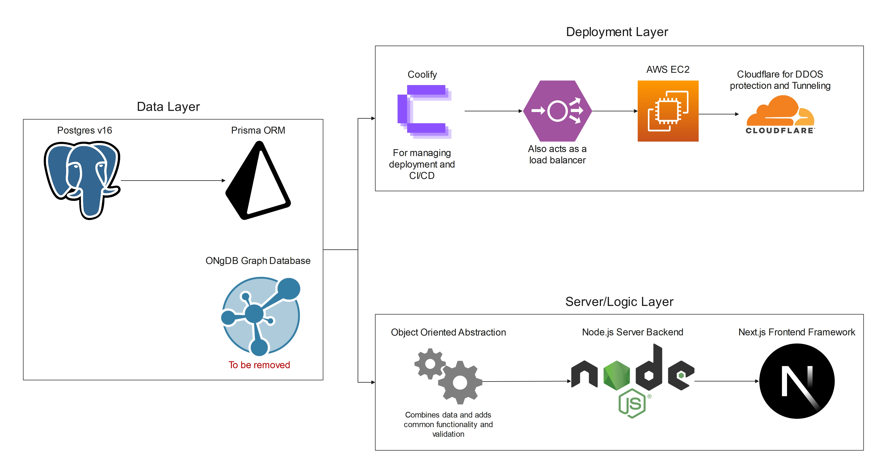

# Altitude CRM Technical Documentation

## Introduction

Altitude is a CRM designed to create "magical moments in software"—making client relationship management smooth, efficient, and, most of all, **fun**.  
It achieves this by combining:
- A user-friendly, intuitive interface built with Next.js (React) and ShadCN UI.
- An AI-powered engine that lets you simply tell it what to do.
- Deep integration of Bill Good Marketing's best practices to either double your growth or halve your workload.

## Architecture



- **Database:**  
  PostgreSQL is used as the primary relational database and is managed via Docker Compose.
- **ORM & Data Layer:**  
  Prisma handles database interactions. A custom wrapper system automatically generates TypeScript classes via `generateModels.ts` to extend raw database objects with additional functionality and strong type-safety.
- **Frontend:**  
  The UI is built with Next.js using ShadCN UI.
- **Server:**  
  A Node.js backend serves the application.
- **Containerization & Deployment:**  
  - **Development:** PostgreSQL is containerized using Docker Compose.
  - **Production:** A multi-stage Dockerfile is provided for building a production image.
  - **Hosting:** In production, the application runs on AWS EC2 instances managed by Coolify for CI/CD and load balancing, with Cloudflare for tunneling and DDoS protection.

## Changelog from Previous Version

- **Removed ONgDB Manual Process:**  
  References to manually starting the ONgDB server (e.g., `./ongdb/bin/ongdb console`) have been removed. In Altitude V2, only PostgreSQL is managed via Docker Compose.
- **Automated Migrations & Demo Data Import:**  
  The environment now automatically applies Prisma migrations and imports demo data (via `npx tsx ./import-playground.ts`) when you start the development server.
- **Improved Startup Delay:**  
  An additional delay has been added to ensure PostgreSQL is fully initialized before running migrations and seeding.
- **Updated Package Scripts:**  
  The `package.json` scripts have been updated to run all tasks concurrently with a single command (`npm run dev`).
- **Production Dockerfile:**  
  A multi-stage Dockerfile is now provided for building a production-ready image.

## Note on Changing the Schema

Matching the Prisma schema with custom TypeScript classes can be complex. To ease this process, a script called `generateModels.ts` automatically updates these classes:
- **Functionality:**  
  It creates new classes for new tables based on the Prisma schema without removing or renaming existing ones.
- **Custom Code:**  
  To prevent overwriting custom code (such as extra imports or search methods), please move them outside the auto-generated block.
- For further details on Prisma schema extensions, refer to the [`PrismaExtensions.md`](PrismaExtensions.md) file.

## Setting Up the Environment

### Prerequisites

1. **Docker & Docker Compose:**  
   Ensure these are installed and the Docker daemon is running.
2. **Java 8:**  
   Required for some backend components.
3. **PostgreSQL User:**  
   The PostgreSQL database is managed via Docker Compose on `localhost:5432`. Create a user named `web` with password `password` that has permissions to read and write to a database named `altitudecrm`. Alternatively, grant permissions for database creation so that Prisma can automatically create the database.

### Automated Environment Startup

When you run:

```bash
npm run dev
```

the following tasks occur concurrently:

1. **Setup:**  
   - The `setup.cjs` script runs to ensure required files (e.g., `docker-compose.yml`) exist and updates your TypeScript models via `generateModels.ts`.

2. **Database Startup:**  
   - Docker Compose starts the PostgreSQL container on `localhost:5432`.

3. **Automatic Migrations & Demo Data Import:**  
   - The process waits for PostgreSQL to be available on port 5432, with an extra delay (5 seconds) to ensure the container is fully initialized.
   - It then runs:
     ```bash
     npx prisma migrate dev --name auto_migration --skip-seed
     npx tsx ./import-playground.ts
     ```
     These commands automatically apply any pending migrations (creating missing tables such as `crm.addresses`) and import demo data needed for authentication and other features.

4. **Prisma Watcher:**  
   - A file watcher monitors `prisma/schema.prisma` for changes and regenerates the Prisma Client when necessary.

5. **Next.js Server:**  
   - The Next.js development server launches on [http://localhost:3000](http://localhost:3000).

### Installing Dependencies

Run:

```bash
npm install
```

to install all required packages.

### (Optional) Database Reset & Manual Seeding

If you need to reset the database before seeding:
1. Clear the database:
   ```bash
   npx prisma db execute --file cleardb.sql
   ```
2. Import sample data manually:
   ```bash
   npx tsx ./import-playground.ts
   ```
   Wait for the “Success!” message before proceeding.

## Available Demo/Admin Accounts

All demo accounts use the password `password`.

| Email                             | First Name | Last Name     |
|-----------------------------------|------------|---------------|
| system@reliablesecurities.com     | System     | Administrator |
| sbrokerman@reliablesecurities.com | Susan      | Brokerman     |
| jsellers@reliablesecurities.com   | James      | Sellers       |
| rhammer@reliablesecurities.com    | Robert     | Hammer        |
| jtreasure@reliablesecurities.com  | Jewel      | Treasure      |
| corwell@reliablesecurities.com    | George     | Orwell        |

*(Note: The email for George Orwell is not a typo—it begins with "corwell".)*

## Running the Application

- **Development Mode:**  
  To start the full development environment—with PostgreSQL on port 5432, automatic migrations and demo data import, and the Next.js server on port 3000—run:

  ```bash
  npm run dev
  ```
  
  The application will be accessible at [http://localhost:3000](http://localhost:3000).

- **Production Mode:**  
  To build and run the production application, execute:

  ```bash
  npm run build
  npm run start
  ```
  
  The production app will be available at [http://localhost:3000](http://localhost:3000).

## Dockerfile for Production

Below is the multi-stage Dockerfile used to build a production-ready image of Altitude CRM:

```dockerfile
# Stage 1: Build the application
FROM node:18-alpine AS builder

# Set the working directory
WORKDIR /app

# Copy package files and install dependencies
COPY package*.json ./
RUN npm ci

# Copy the entire project source code
COPY . .

# (Optional) Run the setup script to generate models if needed
RUN node setup.cjs

# Generate the Prisma client (ensure DATABASE_URL is provided via .env or build arguments)
RUN npx prisma generate

# Build the Next.js application
RUN npm run build

# Stage 2: Production image
FROM node:18-alpine AS runner

# Set the working directory and production environment variable
WORKDIR /app
ENV NODE_ENV=production

# Copy package files and node_modules from the builder stage
COPY --from=builder /app/package*.json ./
COPY --from=builder /app/node_modules ./node_modules

# Copy the built Next.js output and public assets from the builder stage
COPY --from=builder /app/.next ./.next
COPY --from=builder /app/public ./public

# Expose port 3000 for the Next.js server
EXPOSE 3000

# Start the Next.js application
CMD ["npm", "start"]
```

### Building and Running the Docker Image

- **Build the Image:**
  ```bash
  docker build -t altitude-crm .
  ```

- **Run the Container:**
  ```bash
  docker run -p 3000:3000 altitude-crm
  ```

Your production application will then be accessible at [http://localhost:3000](http://localhost:3000).

## Updated Package.json Scripts

Below is an example of the updated **package.json** scripts that integrate the automated migration, demo data import, and a delay to ensure PostgreSQL is fully ready:

```json
{
  "scripts": {
    "setup": "node setup.cjs",
    "db": "COMPOSE_INTERACTIVE_NO_CLI=1 docker-compose up -d",
    "next-dev": "npx cross-env NEXT_OTEL_VERBOSE=1 next dev --turbopack",
    "migrate:dev": "npx prisma migrate dev --name auto_migration --skip-seed",
    "import:demo": "npx tsx ./import-playground.ts",
    "watch:prisma": "wait-on tcp:localhost:5432 -d 5000 && npm run migrate:dev && npm run import:demo && nodemon --watch prisma/schema.prisma --exec \"npx prisma generate && npx prisma generate --sql\"",
    "dev": "concurrently -n SETUP,DB,NEXT,PRISMA \"npm run setup\" \"npm run db\" \"npm run next-dev\" \"npm run watch:prisma\"",
    "build": "npx prisma generate && npx prisma generate --sql && npx next build",
    "start": "npx next start",
    "lint": "npx next lint"
  }
}
```

**Explanation:**
- **`setup`:** Runs the `setup.cjs` script to verify required files and update TypeScript models.
- **`db`:** Starts PostgreSQL via Docker Compose on port 5432.
- **`migrate:dev`:** Automatically applies any pending Prisma migrations (creating missing tables, such as `crm.addresses`).
- **`import:demo`:** Imports demo data required for authentication and other demo features.
- **`watch:prisma`:** Uses `wait-on` with a 5-second delay to ensure PostgreSQL is fully up before running migrations and importing demo data, then starts nodemon to watch for changes in `prisma/schema.prisma` and regenerate the Prisma Client.
- **`dev`:** Uses `concurrently` to run all these tasks in parallel.
- **`build` and `start`:** Build and run the production version of the application.
- **`lint`:** Runs code linting.

## Other Notes

- The application uses ShadCN UI as its frontend framework.
- Enums are auto-generated from the Prisma schema and should not be manually edited. They are located in the `comomon/enum` directory.
- This project uses the experimental React Compiler; some features might not be supported—refer to the `reactcompilererrors.md` file for known issues.
- Additional documentation on specific topics is available in the `documentation` directory.
